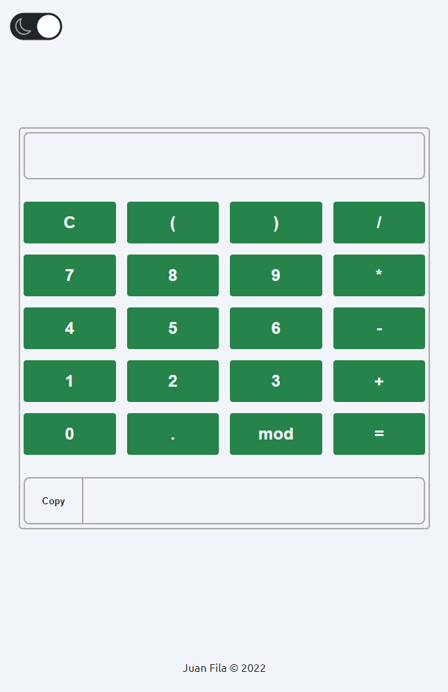

<h1 align="center"> Projeto Calculadora com JS </h1>

Projeto desenvolvido durante o curso da ONEBITCODE

<h4 align="center">
  DARK-MODE
</h4>

  </img>

<h4 align="center">
  CLEAR-MODE
</h4>

  </img>

## 🚀 Tecnologias

Esse projeto foi desenvolvido com as seguintes tecnologias:

- HTML e CSS
- JavaScript

## 💻 Projeto

Projeto de calculadora utilizando elementos DOM para a funcionalidade e implementado estilo com dark-mode/clear-mode.
